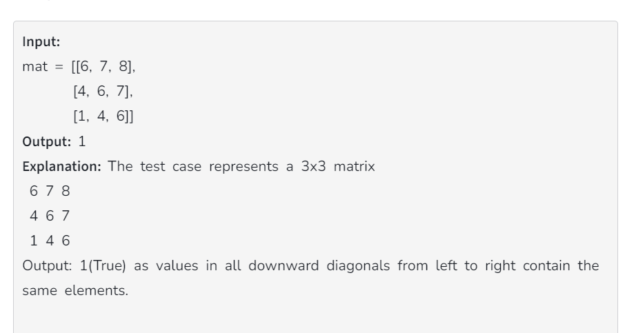
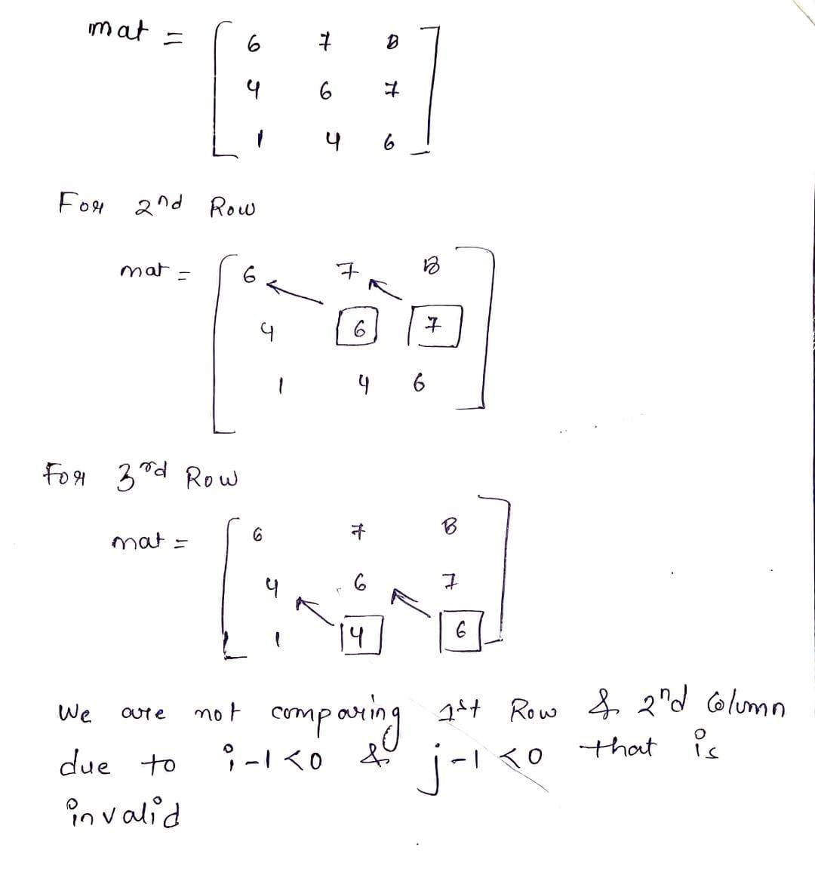

# Intuition:-

 Comparing current element with its respective diagonal element if it is not equal with the previous diagonal element then matrix is not Toeplitz ,otherwise it is Toeplitz matrix
 
 
 ## Given Test Case :
 
 

 ## Implementation :

 